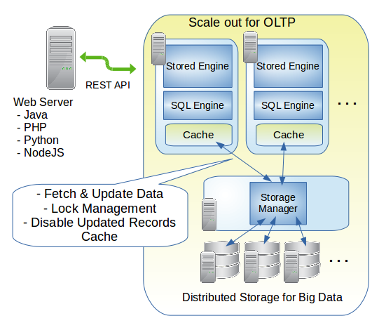

# alinous-elastic-db
Alinous Elastic DB is database for bigdata. It can scale both the SQL engine and storage engine.

## Development status
Currently on development. Reporting the progress on twitter account [@alinous_core](https://twitter.com/alinous_core).

## Source code

Following directries has source code.

### main
The main part of the Alinous Elastic DB.

### lib
The body part of this program is provided by shared library.

#### lib/src_lib

C++ source codes of Java to C++ convertor.

 - System functions
 - Garbase collection engine
 - External JVM support

#### lib/src_java

C++ source code converted from Java soource code.

